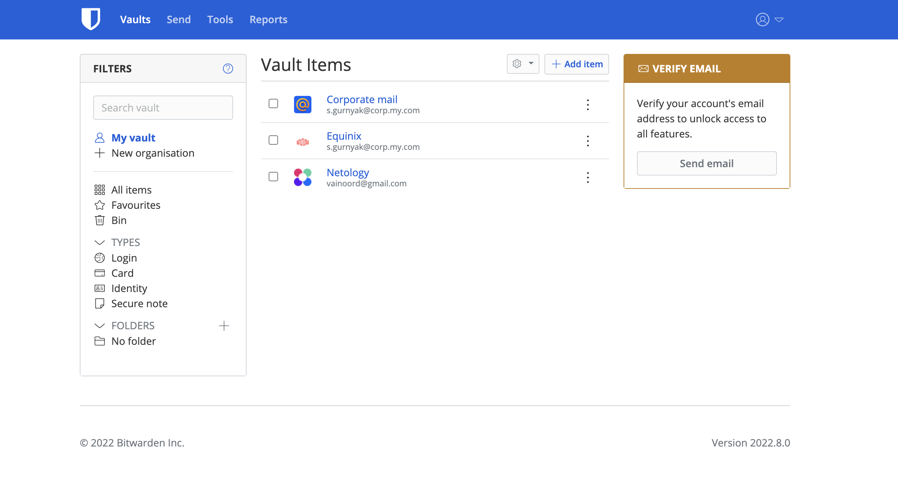
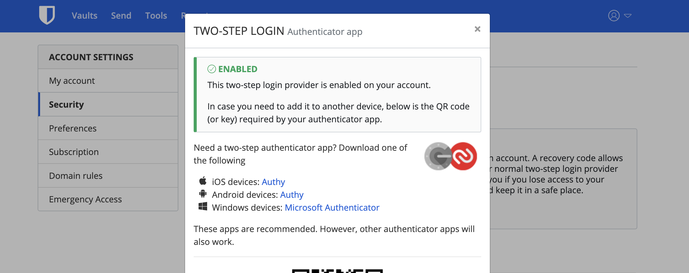
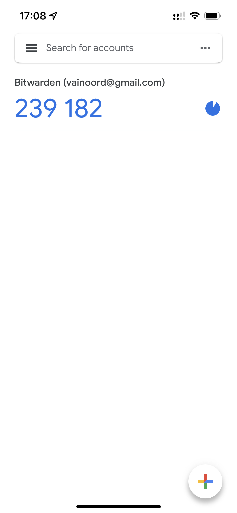
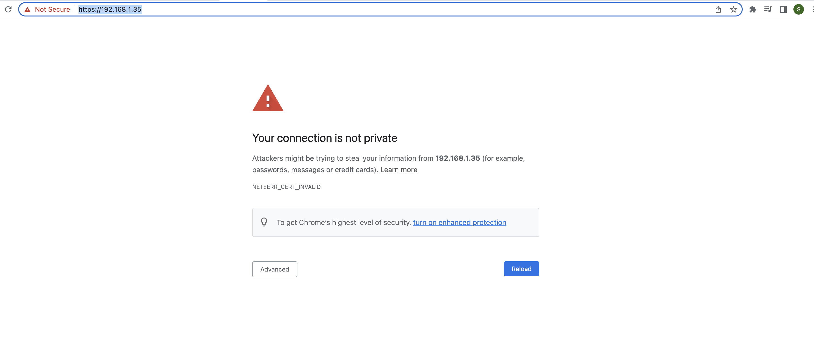
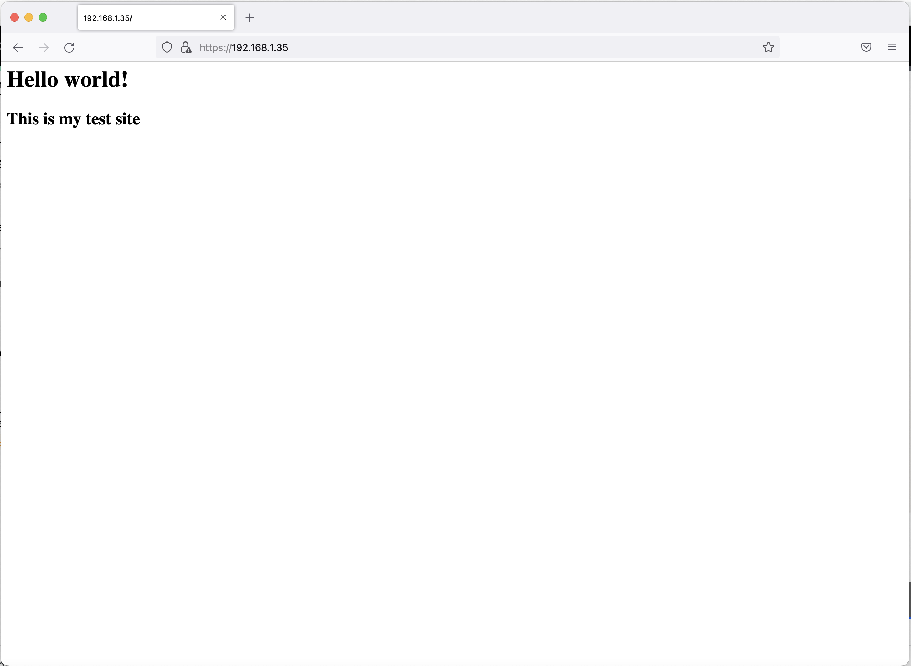
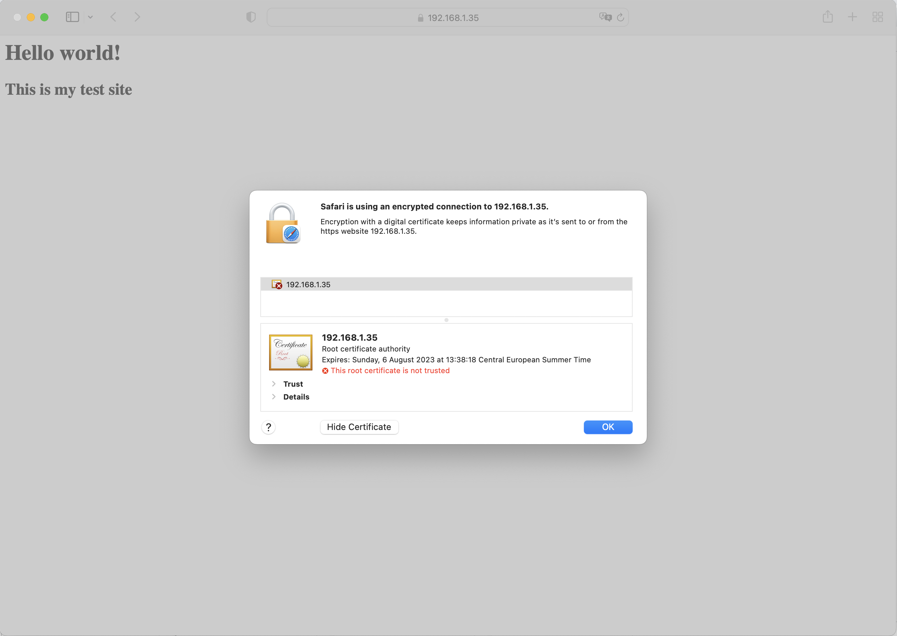
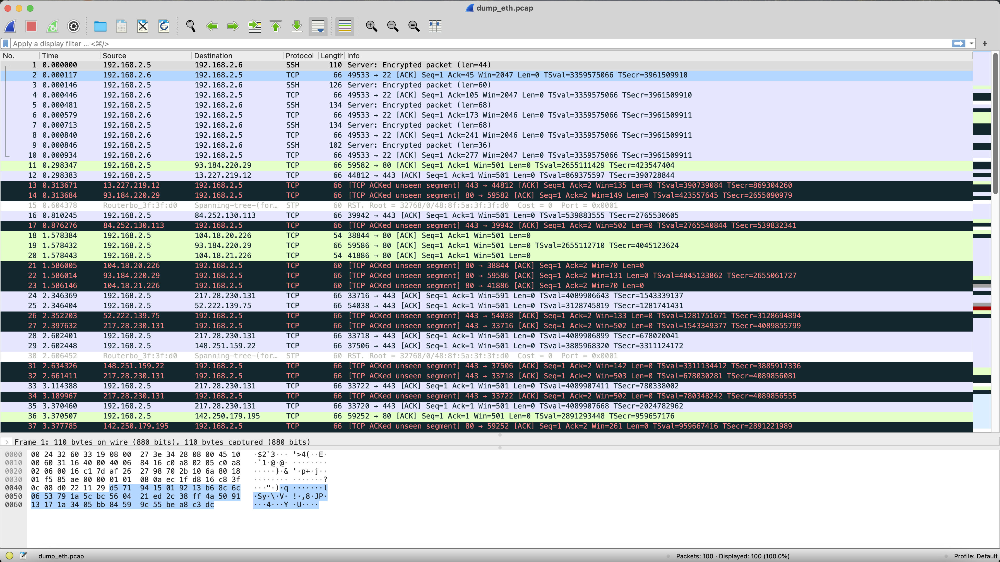

## 3.9. Элементы безопасности информационных систем
---
1. >Установите Bitwarden плагин для браузера. Зарегестрируйтесь и сохраните несколько паролей.

Успешно зарегистрировался и добавил 3 реквизита аутентификации.



---
2. >Установите Google authenticator на мобильный телефон. Настройте вход в Bitwarden акаунт через Google authenticator OTP.

Настроена двухфакторная аутентификация с использованием приложений Google Authentificator и Authy.






--- 
3. >Установите apache2, сгенерируйте самоподписанный сертификат, настройте тестовый сайт для работы по HTTPS.


Выполнено.


В разных браузерах картина различная.

В chrome сайт по самоподписанному сертификату с https не открывается:


В firefox:


В safari:


---
4. >Проверьте на TLS уязвимости произвольный сайт в интернете (кроме сайтов МВД, ФСБ, МинОбр, НацБанк, РосКосмос, РосАтом, РосНАНО и любых госкомпаний, объектов КИИ, ВПК ... и тому подобное).

Проверен сайт парижского диснейленда.
```
vainoord@dev-vm-vnrd:~/testssl.sh$ ./testssl.sh -U --sneaky https://www.disneylandparis.com/

###########################################################
    testssl.sh       3.1dev from https://testssl.sh/dev/
    (730c758 2022-08-02 13:28:56)

      This program is free software. Distribution and
             modification under GPLv2 permitted.
      USAGE w/o ANY WARRANTY. USE IT AT YOUR OWN RISK!

       Please file bugs @ https://testssl.sh/bugs/

###########################################################

 Using "OpenSSL 1.0.2-chacha (1.0.2k-dev)" [~179 ciphers]
 on dev-vm-vnrd:./bin/openssl.Linux.x86_64
 (built: "Jan 18 17:12:17 2019", platform: "linux-x86_64")


 Start 2022-08-09 13:51:02        -->> 23.216.255.87:443 (www.disneylandparis.com) <<--

 rDNS (23.216.255.87):   a23-216-255-87.deploy.static.akamaitechnologies.com.
 Service detected:       HTTP


 Testing vulnerabilities 

 Heartbleed (CVE-2014-0160)                not vulnerable (OK), no heartbeat extension
 CCS (CVE-2014-0224)                       not vulnerable (OK)
 Ticketbleed (CVE-2016-9244), experiment.  not vulnerable (OK)
 ROBOT                                     not vulnerable (OK)
 Secure Renegotiation (RFC 5746)           supported (OK)
 Secure Client-Initiated Renegotiation     not vulnerable (OK)
 CRIME, TLS (CVE-2012-4929)                not vulnerable (OK)
 BREACH (CVE-2013-3587)                    no gzip/deflate/compress/br HTTP compression (OK)  - only supplied "/" tested
 POODLE, SSL (CVE-2014-3566)               not vulnerable (OK)
 TLS_FALLBACK_SCSV (RFC 7507)              No fallback possible (OK), no protocol below TLS 1.2 offered
 SWEET32 (CVE-2016-2183, CVE-2016-6329)    not vulnerable (OK)
 FREAK (CVE-2015-0204)                     not vulnerable (OK)
 DROWN (CVE-2016-0800, CVE-2016-0703)      not vulnerable on this host and port (OK)
                                           make sure you don't use this certificate elsewhere with SSLv2 enabled services, see
                                           https://search.censys.io/search?resource=hosts&virtual_hosts=INCLUDE&q=4DBC4EFE0F4C142AD01CF66ED9D00252C442AFE52AA9C77A0AF3363060C55B72
 LOGJAM (CVE-2015-4000), experimental      not vulnerable (OK): no DH EXPORT ciphers, no DH key detected with <= TLS 1.2
 BEAST (CVE-2011-3389)                     not vulnerable (OK), no SSL3 or TLS1
 LUCKY13 (CVE-2013-0169), experimental     potentially VULNERABLE, uses cipher block chaining (CBC) ciphers with TLS. Check patches
 Winshock (CVE-2014-6321), experimental    not vulnerable (OK)
 RC4 (CVE-2013-2566, CVE-2015-2808)        no RC4 ciphers detected (OK)


 Done 2022-08-09 13:51:34 [  34s] -->> 23.216.255.87:443 (www.disneylandparis.com) <<--

```


---
5. >Установите на Ubuntu ssh сервер, сгенерируйте новый приватный ключ. Скопируйте свой публичный ключ на другой сервер. Подключитесь к серверу по SSH-ключу.

Выполнено.
Вход без пароля пользователя, но у ключа есть парольная фраза:
```
vainoord@dev-vm-vnrd:~$ ssh 'vainoord@192.168.2.4'
Enter passphrase for key '/home/vainoord/.ssh/id_rsa': 
Welcome to Ubuntu 22.04 LTS (GNU/Linux 5.15.0-43-generic x86_64)

 * Documentation:  https://help.ubuntu.com
 * Management:     https://landscape.canonical.com
 * Support:        https://ubuntu.com/advantage

  System information as of Tue Aug  9 12:04:10 PM UTC 2022

  System load:  0.23876953125     Processes:               118
  Usage of /:   45.9% of 9.75GB   Users logged in:         0
  Memory usage: 23%               IPv4 address for enp0s3: 192.168.2.4
  Swap usage:   0%


34 updates can be applied immediately.
To see these additional updates run: apt list --upgradable


Last login: Tue Aug  9 12:08:23 2022 from 192.168.2.5
vainoord@dev-srv:~$ 

```


---
6. >Переименуйте файлы ключей из задания 5. Настройте файл конфигурации SSH клиента, так чтобы вход на удаленный сервер осуществлялся по имени сервера.	
Выполнено.

```
vainoord@dev-vm-vnrd:~$ ls -lah .ssh/
total 28K
drwx------  2 vainoord vainoord 4,0K aug  9 14:59 .
drwxr-x--- 17 vainoord vainoord 4,0K aug  9 14:06 ..
-rw-------  1 vainoord vainoord   82 aug  9 14:59 config
-rw-------  1 vainoord vainoord  978 aug  9 14:08 known_hosts
-rw-r--r--  1 vainoord vainoord  142 aug  9 14:08 known_hosts.old
-rw-------  1 vainoord vainoord 2,6K aug  9 14:07 ssh_key
-rw-r--r--  1 vainoord vainoord  574 aug  9 14:07 ssh_key.pub
```

```
vainoord@dev-vm-vnrd:~$ cat /home/vainoord/.ssh/config 
Host dev-srv
  Hostname 192.168.2.4
  IdentityFile ~/.ssh/ssh_key
  User vainoord
```

```
vainoord@dev-vm-vnrd:~/.ssh$ ssh dev-srv
Enter passphrase for key '/home/vainoord/.ssh/ssh_key': 
Welcome to Ubuntu 22.04 LTS (GNU/Linux 5.15.0-43-generic x86_64)

 * Documentation:  https://help.ubuntu.com
 * Management:     https://landscape.canonical.com
 * Support:        https://ubuntu.com/advantage

  System information as of Tue Aug  9 12:04:10 PM UTC 2022
  System load:  0.23876953125     Processes:               118
  Usage of /:   45.9% of 9.75GB   Users logged in:         0
  Memory usage: 23%               IPv4 address for enp0s3: 192.168.2.4
  Swap usage:   0%


34 updates can be applied immediately.
To see these additional updates run: apt list --upgradable


Last login: Tue Aug  9 12:36:06 2022 from 192.168.2.5

```


---
7. >Соберите дамп трафика утилитой tcpdump в формате pcap, 100 пакетов. Откройте файл pcap в Wireshark.	

Выполнено.


---

