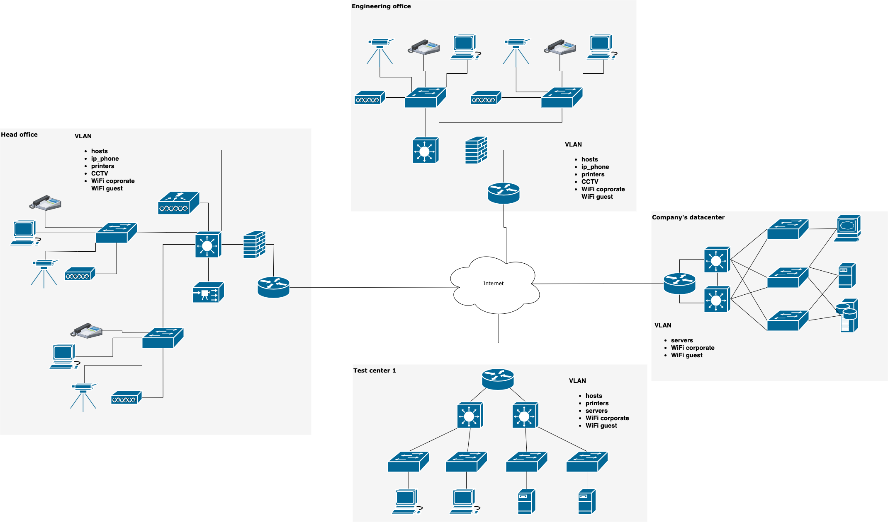

## 3.8. Компьютерные сети, лекция 3
---
1. >Подключитесь к публичному маршрутизатору в интернет. Найдите маршрут к вашему публичному IP

```
route-views>show ip route 217.105.31.162                
Routing entry for 217.105.0.0/19, supernet
  Known via "bgp 6447", distance 20, metric 0
  Tag 3356, type external
  Last update from 4.68.4.46 4w3d ago
  Routing Descriptor Blocks:
  * 4.68.4.46, from 4.68.4.46, 4w3d ago
      Route metric is 0, traffic share count is 1
      AS Hops 3
      Route tag 3356
      MPLS label: none
```
```
route-views>show bgp 217.105.31.162     
BGP routing table entry for 217.105.0.0/19, version 2328563618
Paths: (24 available, best #16, table default)
  Not advertised to any peer
  Refresh Epoch 1
  20912 3257 6830 33915
    212.66.96.126 from 212.66.96.126 (212.66.96.126)
      Origin incomplete, localpref 100, valid, external
      Community: 3257:8050 3257:30091 3257:50001 3257:54100 3257:54101 20912:65004
      path 7FE0C271F898 RPKI State valid
      rx pathid: 0, tx pathid: 0
  Refresh Epoch 1
  19214 3257 6830 33915
    208.74.64.40 from 208.74.64.40 (208.74.64.40)
      Origin incomplete, localpref 100, valid, external
      Community: 3257:8044 3257:30383 3257:50002 3257:51200 3257:51201
      path 7FE0435C1058 RPKI State valid
      rx pathid: 0, tx pathid: 0
  Refresh Epoch 1
  3267 3356 6830 33915
    194.85.40.15 from 194.85.40.15 (185.141.126.1)
      Origin IGP, metric 0, localpref 100, valid, external
      path 7FE041D3F7F8 RPKI State valid
      rx pathid: 0, tx pathid: 0
  Refresh Epoch 1
  1351 6939 6830 33915
    132.198.255.253 from 132.198.255.253 (132.198.255.253)
      Origin IGP, localpref 100, valid, external
      path 7FE028E5F730 RPKI State valid
      rx pathid: 0, tx pathid: 0
  Refresh Epoch 1
  20130 6939 6830 33915
    140.192.8.16 from 140.192.8.16 (140.192.8.16)
      Origin IGP, localpref 100, valid, external
      path 7FE0DF492838 RPKI State valid
      rx pathid: 0, tx pathid: 0
  Refresh Epoch 1
  3333 6830 33915
    193.0.0.56 from 193.0.0.56 (193.0.0.56)
```

---
2. >Создайте dummy0 интерфейс в Ubuntu. Добавьте несколько статических маршрутов. Проверьте таблицу маршрутизации.

Создан интерфейс dummy0
```
root@dev-vm:/home/vagrant# echo "dummy0" >> /etc/modules
root@dev-vm:/home/vagrant# echo "options dummy numdummies=2" > /etc/modprobe.d/dummy.conf

root@dev-vm:/home/vagrant# ip address show dummy0
3: dummy0: <BROADCAST,MULTICAST,UP,LOWER_UP> mtu 1500 qdisc noqueue state UNKNOWN group default qlen 1000
    link/ether 4a:ad:7c:0c:e8:85 brd ff:ff:ff:ff:ff:ff
    inet 169.254.1.1/32 scope global dummy0
       valid_lft forever preferred_lft forever
    inet6 fe80::48ad:7cff:fe0c:e885/64 scope link 
       valid_lft forever preferred_lft forever
```

Добавлены статические маршруты с метрикой 120:
```
root@dev-vm:/home/vagrant# ip -br route
default via 10.0.2.2 dev eth0 proto dhcp src 10.0.2.15 metric 100 
10.0.2.0/24 dev eth0 proto kernel scope link src 10.0.2.15 
10.0.2.2 dev eth0 proto dhcp scope link src 10.0.2.15 metric 100 
172.17.150.0/26 dev eth0 scope link metric 120 
192.168.200.0/24 dev dummy0 scope link metric 120 
```

--- 
3. > Проверьте открытые TCP порты в Ubuntu, какие протоколы и приложения используют эти порты? Приведите несколько примеров.

```
root@dev-vm:/home/vagrant# ss -pat
State  Recv-Q Send-Q Local Address:Port   Peer Address:Port Process                                               
LISTEN 0      4096   127.0.0.53%lo:domain      0.0.0.0:*     users:(("systemd-resolve",pid=669,fd=13))            
LISTEN 0      128          0.0.0.0:ssh         0.0.0.0:*     users:(("sshd",pid=774,fd=3))                        
ESTAB  0      0          10.0.2.15:ssh        10.0.2.2:52163 users:(("sshd",pid=1402,fd=4),("sshd",pid=1357,fd=4))
LISTEN 0      128             [::]:ssh            [::]:*     users:(("sshd",pid=774,fd=4)) 
``` 

---
4. >Проверьте используемые UDP сокеты в Ubuntu, какие протоколы и приложения используют эти порты?

```
root@dev-vm:/home/vagrant# ss -pau
State   Recv-Q  Send-Q    Local Address:Port       Peer Address:Port  Process                                     
UNCONN  0       0         127.0.0.53%lo:domain          0.0.0.0:*      users:(("systemd-resolve",pid=669,fd=12))  
UNCONN  0       0        10.0.2.15%eth0:bootpc          0.0.0.0:*      users:(("systemd-network",pid=636,fd=19)) 
```


---
5. >Используя diagrams.net, создайте L3 диаграмму вашей домашней сети или любой другой сети, с которой вы работали.	



---


