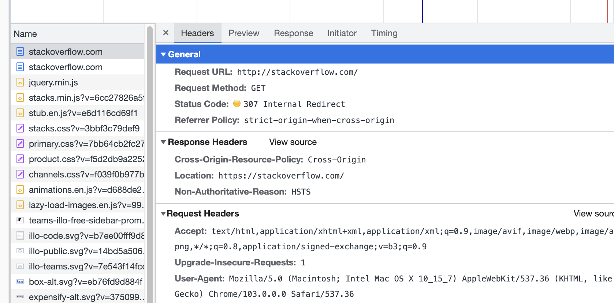
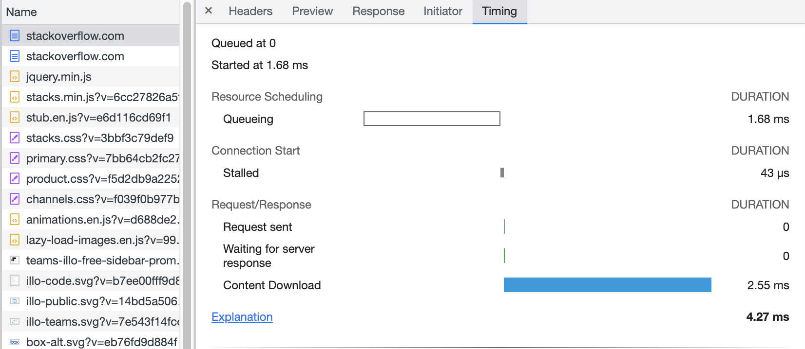
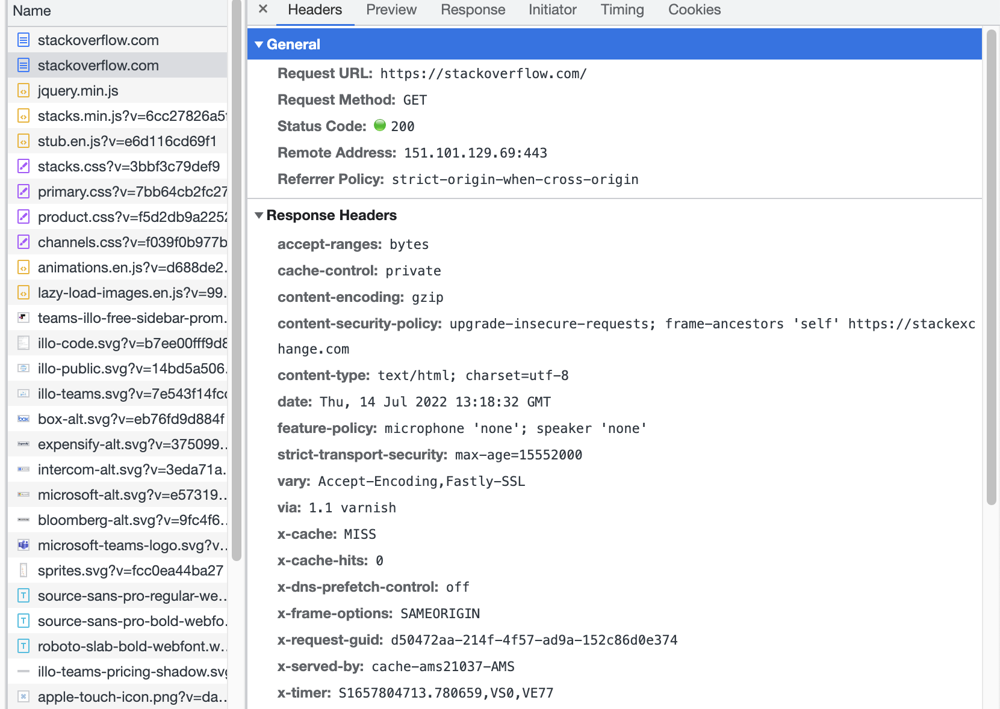
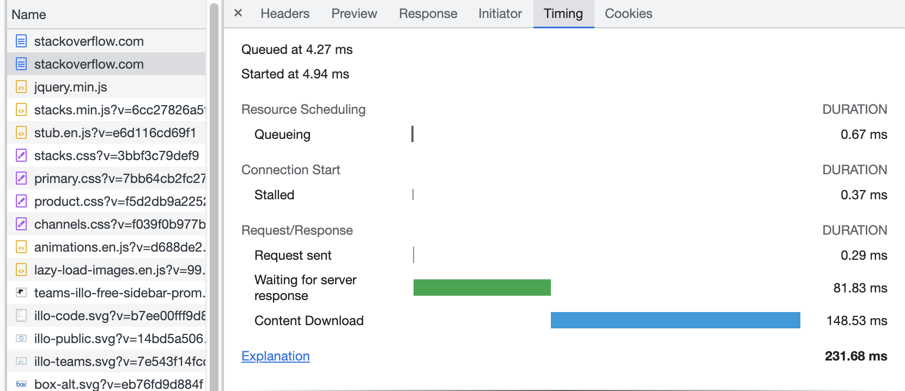
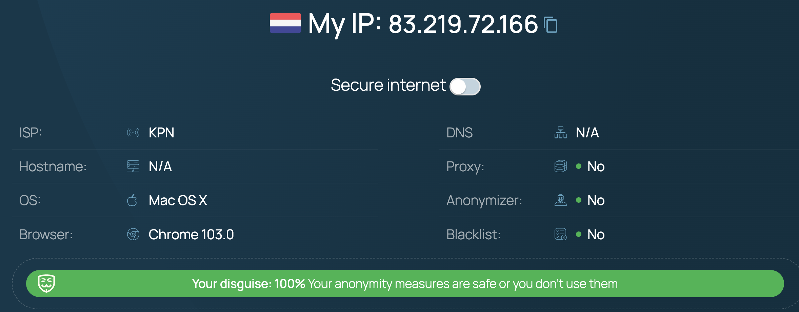

## 3.6. Компьютерные сети, лекция 1
---
1. >Работа c HTTP через телнет.
   >* Подключитесь утилитой телнет к сайту stackoverflow.com telnet stackoverflow.com 80
   >* отправьте HTTP запрос
   >* В ответе укажите полученный HTTP код, что он означает?
```
	GET /questions HTTP/1.0
	HOST: stackoverflow.com
	[press enter]
	[press enter]
```

```
vagrant@dev-vm:~$ telnet stackoverflow.com 80
Trying 151.101.129.69...
Connected to stackoverflow.com.
Escape character is '^]'.
GET /questions HTTP/1.0
HOST: stackoverflow.com

HTTP/1.1 301 Moved Permanently
cache-control: no-cache, no-store, must-revalidate
location: https://stackoverflow.com/questions
x-request-guid: b35e3f6f-38bf-43b9-b972-2d5b800a1df8
feature-policy: microphone 'none'; speaker 'none'
content-security-policy: upgrade-insecure-requests; frame-ancestors 'self' https://stackexchange.com
Accept-Ranges: bytes
Date: Tue, 12 Jul 2022 18:36:24 GMT
Via: 1.1 varnish
Connection: close
X-Served-By: cache-ams21080-AMS
X-Cache: MISS
X-Cache-Hits: 0
X-Timer: S1657650985.799582,VS0,VE74
Vary: Fastly-SSL
X-DNS-Prefetch-Control: off
Set-Cookie: prov=4299af14-cbd8-405e-4937-973d0c7ba4a5; domain=.stackoverflow.com; expires=Fri, 01-Jan-2055 00:00:00 GMT; path=/; HttpOnly

Connection closed by foreign host.
```   

Запрос вернул HTTP код 301 - возможно настроен принудительный редирект с 80 порта. И соединение было закрыто удаленным хостом.

---
2. >Повторите задание 1 в браузере, используя консоль разработчика F12
   >* откройте вкладку Network
   >* отправьте запрос http://stackoverflow.com
   >* найдите первый ответ HTTP сервера, откройте вкладку Headers
   >* укажите в ответе полученный HTTP код.
   >* проверьте время загрузки страницы, какой запрос обрабатывался дольше всего?
   >* приложите скриншот консоли браузера в ответ.









--- 
3. > Какой IP адрес у вас в интернете?

83.219.72.166



---
4. >Какому провайдеру принадлежит ваш IP адрес? Какой автономной системе AS? Воспользуйтесь утилитой `whois`

```
[vainoord@vnrd-mypc:~]$ whois -h whois.ripe.net 83.219.72.166
inetnum:        83.219.72.0 - 83.219.79.255
netname:        NL-IS-SYSCONAUT
descr:          cust 20206-05901732.1
country:        NL
admin-c:        AS15879-RIPE
tech-c:         AS15879-RIPE
status:         ASSIGNED PA
mnt-by:         KPNIS-MNT
created:        2016-11-10T15:59:41Z
last-modified:  2020-09-07T18:01:14Z
source:         RIPE

...

% Information related to '83.219.64.0/19AS15879'

route:          83.219.64.0/19
descr:          KPN Internedservices
origin:         AS15879
mnt-by:         KPNIS-MNT
mnt-lower:      KPNIS-MNT
mnt-routes:     KPNIS-MNT
created:        2011-02-08T09:12:13Z
last-modified:  2020-09-07T13:45:32Z
source:         RIPE # Filtered
```


---
5. >Через какие сети проходит пакет, отправленный с вашего компьютера на адрес 8.8.8.8? Через какие AS? Воспользуйтесь утилитой `traceroute`

```
vagrant@dev-vm:~$ traceroute -An 8.8.8.8
traceroute to 8.8.8.8 (8.8.8.8), 30 hops max, 60 byte packets
 1  10.0.2.2 [*]  0.166 ms  0.139 ms  0.124 ms
 2  172.19.220.1 [*]  7.996 ms  6.132 ms  8.935 ms
 3  172.19.218.52 [*]  7.816 ms  7.799 ms  7.786 ms
 4  83.219.72.161 [AS15879]  7.773 ms * *
 5  82.201.93.193 [AS15879]  9.986 ms  9.840 ms  9.895 ms
 6  91.206.80.2 [AS15879]  7.353 ms  4.520 ms  4.499 ms
 7  213.133.37.28 [AS15879]  28.524 ms 213.133.37.30 [AS15879]  7.772 ms  7.617 ms
 8  145.54.66.168 [*]  12.288 ms  12.066 ms 145.54.66.166 [*]  7.409 ms
 9  * * *
10  209.85.149.38 [AS15169]  10.438 ms * *
11  * * *
12  8.8.8.8 [AS15169]  7.514 ms 142.250.224.133 [AS15169]  8.572 ms 142.251.66.239 [AS15169]  7.460 ms
```

---
6. >Повторите задание 5 в утилите mtr. На каком участке наибольшая задержка - delay?

```
dev-vm (10.0.2.15)                                                          2022-07-16T12:21:35+0000
Keys:  Help   Display mode   Restart statistics   Order of fields   quit
                                                            Packets               Pings
 Host                                                     Loss%   Snt   Last   Avg  Best  Wrst StDev
 1. AS???    10.0.2.2                                      0.0%    62    0.4   1.3   0.2  46.1   5.9
 2. AS???    192.168.1.1                                   0.0%    62    2.5   3.9   1.7  15.9   3.5
 3. AS???    10.220.20.1                                   0.0%    62    3.5   6.1   1.7  40.3   7.5
 4. AS33915  217.105.31.129                                0.0%    62    5.9  25.5   4.1 123.6  28.9
 5. AS12315  213.34.63.13                                  0.0%    62    5.8   7.6   3.6  42.6   5.7
 6. AS33915  213.51.7.92                                   0.0%    61    7.8   7.3   3.6  25.2   3.3
 7. AS33915  213.51.64.186                                 1.6%    61    5.4  13.7   4.0  45.7  10.8
 8. AS33915  213.46.182.22                                 0.0%    61    7.3   8.0   4.8  33.6   4.7
 9. AS15169  142.251.70.127                                0.0%    61   34.1   7.6   4.2  34.1   4.6
10. AS15169  142.251.48.175                                0.0%    61    4.5   7.3   3.7  43.7   5.9
11. AS15169  8.8.8.8                                       0.0%    61    5.3   6.0   3.6  17.2   2.2
```
Узел 9 имеет наибольший показатель latency по сравнению с другими узлами.

---
7. >Какие DNS сервера отвечают за доменное имя dns.google? Какие A записи? воспользуйтесь утилитой `dig`

Серверы DNS через команду `dig NS dns.google`:
```
;; ANSWER SECTION:
dns.google.		21600	IN	NS	ns2.zdns.google.
dns.google.		21600	IN	NS	ns1.zdns.google.
dns.google.		21600	IN	NS	ns3.zdns.google.
dns.google.		21600	IN	NS	ns4.zdns.google.

```
A записи через команду `dig A dns.google`:
```
;; ANSWER SECTION:
dns.google.		900	IN	A	8.8.4.4
dns.google.		900	IN	A	8.8.8.8

```

---
8. >Проверьте PTR записи для IP адресов из задания 7. Какое доменное имя привязано к IP? воспользуйтесь утилитой `dig`

```
[vainoord@vnrd-mypc:~]$ dig -x 8.8.8.8

; <<>> DiG 9.10.6 <<>> -x 8.8.8.8
;; global options: +cmd
;; Got answer:
;; ->>HEADER<<- opcode: QUERY, status: NOERROR, id: 43268
;; flags: qr rd ra; QUERY: 1, ANSWER: 1, AUTHORITY: 0, ADDITIONAL: 1

;; OPT PSEUDOSECTION:
; EDNS: version: 0, flags:; udp: 512
;; QUESTION SECTION:
;8.8.8.8.in-addr.arpa.		IN	PTR

;; ANSWER SECTION:
8.8.8.8.in-addr.arpa.	85205	IN	PTR	dns.google.

;; Query time: 39 msec
;; SERVER: 213.160.212.3#53(213.160.212.3)
;; WHEN: Sat Jul 16 17:04:49 CEST 2022
;; MSG SIZE  rcvd: 73


[vainoord@vnrd-mypc:~]$ dig -x 8.8.4.4

; <<>> DiG 9.10.6 <<>> -x 8.8.4.4
;; global options: +cmd
;; Got answer:
;; ->>HEADER<<- opcode: QUERY, status: NOERROR, id: 13045
;; flags: qr rd ra; QUERY: 1, ANSWER: 1, AUTHORITY: 0, ADDITIONAL: 1

;; OPT PSEUDOSECTION:
; EDNS: version: 0, flags:; udp: 512
;; QUESTION SECTION:
;4.4.8.8.in-addr.arpa.		IN	PTR

;; ANSWER SECTION:
4.4.8.8.in-addr.arpa.	86400	IN	PTR	dns.google.

;; Query time: 197 msec
;; SERVER: 213.160.212.3#53(213.160.212.3)
;; WHEN: Sat Jul 16 17:04:52 CEST 2022
;; MSG SIZE  rcvd: 73

```

---

