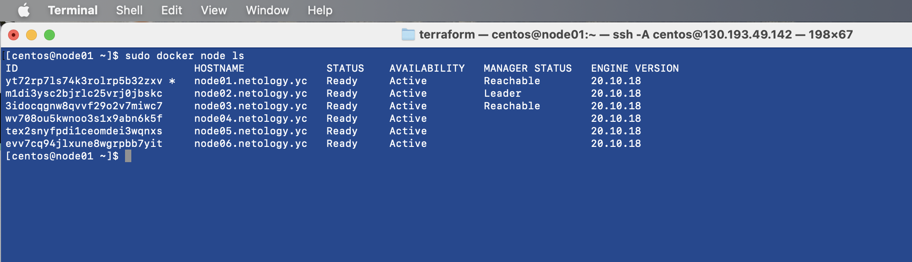

# Домашнее задание к занятию "5.5. Оркестрация кластером Docker контейнеров на примере Docker Swarm"

## Задача 1

Дайте письменые ответы на следующие вопросы:

- В чём отличие режимов работы сервисов в Docker Swarm кластере: replication и global?
- Какой алгоритм выбора лидера используется в Docker Swarm кластере?
- Что такое Overlay Network?

#### Ответ

Mode `replicated` (по-умолчанию) означает, что n-е количество контейнеров Swarm сервиса будет запущено планировщиком на всех доступных нодах. Количество контейнеров задается с ключом `--replicas`.
Mode `global` означает, что планировщик разместит ровно один экземпляр на всех возможных нодах, которые соответствуют ограничениям размещения службы (placement constraints, указание нод с определенными лейблами) и требованиям к ресурсам (нода должна иметь ресурсы не ниже указанным в ключах `--reserve-memory` or `--reserve-cpu`).

Выбор лидера среди `manager node` определяется с помощью `raft concensus algorithm`. Каждая нода с ролью `manager` может быть в трех состояниях: `follower` (по-умолчанию), `candidate` или `leader`. Краткая работа алгоритма: если `follower` не получает от `leader` ответа, то `follower` меняет статус на `candidate` и инициирует голосование среди управляющих нод, предложив себя в качестве лидирующей ноды. Если эта нода получает большинство подтверждений, она меняет статус на `leader`.

Overlay network - это виртуальная сеть, задача которой обеспечить взаимодействие узлов. Overlay network строится поверх существующей инфраструктуры и ее использование позволяет не настраивать маршрутизацию на уровне ОС между нодами. Таким образом, служебный трафик идет в изолированной сети, используя для этого протокол виртуализации VXLAN.


## Задача 2

Создать ваш первый Docker Swarm кластер в Яндекс.Облаке

Для получения зачета, вам необходимо предоставить скриншот из терминала (консоли), с выводом команды:
```
docker node ls  
```

#### Ответ

<p align="center">
  
</p>

## Задача 3

Создать ваш первый, готовый к боевой эксплуатации кластер мониторинга, состоящий из стека микросервисов.

Для получения зачета, вам необходимо предоставить скриншот из терминала (консоли), с выводом команды:
```
docker service ls
```

#### Ответ

<p align="center">
  
</p>

## Задача 4 (*)

Выполнить на лидере Docker Swarm кластера команду (указанную ниже) и дать письменное описание её функционала, что она делает и зачем она нужна:
```
# см.документацию: https://docs.docker.com/engine/swarm/swarm_manager_locking/
docker swarm update --autolock=true
```

####  Ответ

```
[centos@node02 ~]$ sudo docker swarm update --autolock=true
Swarm updated.
To unlock a swarm manager after it restarts, run the `docker swarm unlock`
command and provide the following key:

    ****************************************************

Please remember to store this key in a password manager, since without it you
will not be able to restart the manager.

[centos@node02 ~]$ sudo service docker restart
Redirecting to /bin/systemctl restart docker.service

[centos@node02 ~]$ sudo docker node ls
Error response from daemon: Swarm is encrypted and needs to be unlocked before it can be used. Please use "docker swarm unlock" to unlock it.
```

Команда `docker swarm [init/update] --autolock=true` включает защиту ключей взаимного шифрования TLS и шифрования и расшифровки  неактивных журналов Raft. При перезапуске Docker ключ TLS, используемый для шифрования связи между узлами группы мелких объектов, и ключ, используемый для шифрования и расшифровки журналов Raft на диске, загружаются в память каждого узла docker swarm.

Если параметр --autolock включен, при перезапуске Docker сначала необходимо разблокировать группу мелких объектов, используя ключ шифрования ключей, созданный Docker при инициализации группы мелких объектов.

---

### Как cдавать задание

Выполненное домашнее задание пришлите ссылкой на .md-файл в вашем репозитории.

---
